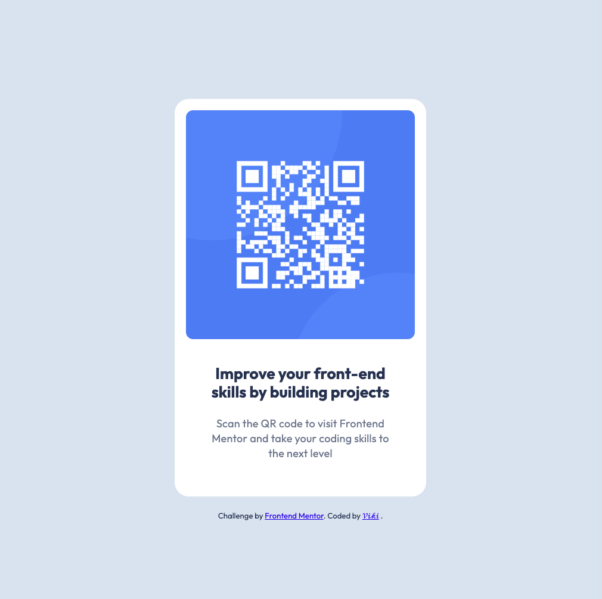

# Frontend Mentor - QR code component solution

This is a solution to the [QR code component challenge on Frontend Mentor](https://www.frontendmentor.io/challenges/qr-code-component-iux_sIO_H). Frontend Mentor challenges help you improve your coding skills by building realistic projects. 

## Table of contents

- [Overview](#overview)
  - [Screenshot](#screenshot)
  - [Links](#links)
- [My process](#my-process)
  - [Built with](#built-with)
  - [What I learned](#what-i-learned)
  - [Continued development](#continued-development)
  - [AI Collaboration](#ai-collaboration)
- [Author](#author)

## Overview

### Screenshot

### Links

- Solution URL: [Add solution URL here](https://your-solution-url.com)
- Live Site URL: [Add live site URL here](https://your-live-site-url.com)

## My process

### Built with

- Semantic HTML5 markup
- Flexbox

### What I learned

- How to use Flexbox to center elements on a page
- The difference between padding (space inside an element) and margin (space outside)
- How to load and use a Google Font
- How to read design values from Figma (colors, font sizes, border radius, padding)
- How CSS properties like border-radius, font-size, font-weight, text-align, and line-height work

### Continued development

I want to continue practicing HTML and CSS by working through more Frontend Mentor challenges. I'd like to get more comfortable with Flexbox and eventually learn new concepts like CSS Grid, responsive design, and maybe JavaScript in the future.

### AI Collaboration

I used Claude (Claude Code) as a guided mentor throughout this project. Claude walked me through each step — from structuring the HTML, writing CSS properties, using Flexbox for centering, to reading values from Figma. Rather than giving me the answers directly, Claude asked questions and gave hints to help me figure things out myself.

## Author

- GitHub - [vikiluk](https://github.com/vikiluk)
- Frontend Mentor - [@vikiluk](https://www.frontendmentor.io/profile/vikiluk)
- [LinkedIn](https://www.linkedin.com/in/viktória-lukáčová-960a51253/)